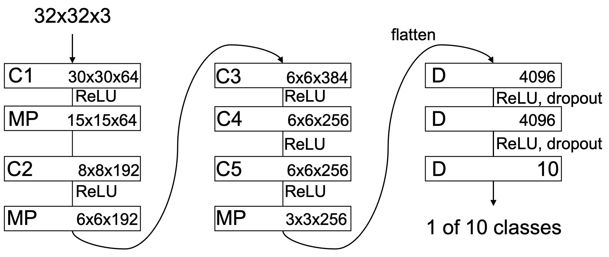

[](https://colab.research.google.com/drive/1wEK-ta-3APQF28ZyCZfNtURjnmC4lSxP?usp=sharing)

## 概要

CIFAR-10を使用した画像分類器の生成を**Google Colaboratory**+**TensorBoard**で実装します.

ここでは, 環境構築から実行, ネットワークアーキテクチャの解説をします.


前提として, **CIFAR-10**とは動物や乗り物の画像を集めたオープンデータセットであり, ニューラルネットワークの画像認識用データに最も多く用いられるデータセットの1つです.

今回取り扱うネットワークは**AlexNet**と**ResNet**です.
上記のネットワークを**Pytorch**で実装し, トレーニングからテストまでをおこないます.

トレーニング中の様子は**TendorFlow**の視覚化ツールキット**TensorBoard**を実装して確認していきます.

## 学んだこと

- Google Colaboratoryでの開発
- TensorBoardの実装
- Pytorchを利用したCNNの実装

## 始める前のスキルセット

- Pythonの基礎知識

## 実務活用例

- 画像認識(コンピュータービジョン)

## 開発環境

- Google Colaboratory
- Ubuntu 18.04.6 LTS
- TeslaT4
- Pytorch==1.12.1

## ツール

- Google Colaboratoryのデフォルトライブラリ

## データセット


ソースコードを[こちら](https://colab.research.google.com/drive/1wEK-ta-3APQF28ZyCZfNtURjnmC4lSxP?usp=sharing)で確認しましょう.

閲覧権限しかないので, 編集する場合はコピーしてください.

CIFAR-10のデータセットは[こちら](https://www.cs.toronto.edu/~kriz/cifar.html#:~:text=CIFAR%2D10%20python%20version)からダウンロードしてください.

## GPU settings

まず, ランタイム>ランタイムのタイプを変更>ハードウェア アクセラレータを"GPU"に変更してください.

ランタイムが変更できているかを確認します.

```python
!nvidia-smi
```
上記のコマンドブロックを実行して以下のような出力がでれば成功です. 
Google Colaboratoryでコードブロックを実行する場合, 実行したいブロックをクリックしてアクティブにしてShift + Enterで実行できます.

```
Sun Dec 11 10:00:01 2022       
+-----------------------------------------------------------------------------+
| NVIDIA-SMI 460.32.03    Driver Version: 460.32.03    CUDA Version: 11.2     |
|-------------------------------+----------------------+----------------------+
| GPU  Name        Persistence-M| Bus-Id        Disp.A | Volatile Uncorr. ECC |
| Fan  Temp  Perf  Pwr:Usage/Cap|         Memory-Usage | GPU-Util  Compute M. |
|                               |                      |               MIG M. |
|===============================+======================+======================|
|   0  Tesla T4            Off  | 00000000:00:04.0 Off |                    0 |
| N/A   62C    P0    30W /  70W |      0MiB / 15109MiB |      0%      Default |
|                               |                      |                  N/A |
+-------------------------------+----------------------+----------------------+
                                                                               
+-----------------------------------------------------------------------------+
| Processes:                                                                  |
|  GPU   GI   CI        PID   Type   Process name                  GPU Memory |
|        ID   ID                                                   Usage      |
|=============================================================================|
|  No running processes found                                                 |
+-----------------------------------------------------------------------------+
```

## Directory config

```python
from google.colab import drive
drive.mount('/content/drive')
```

上記のコマンドブロックを実行してグーグルドライブと接続してください.

ドライブ内のディレクトリ構造は以下のようになります.

先ほどダウンロードして解凍したCIFAR-10データセットを以下のようにグーグルドライブ内の```Colabo Notebooks```ディレクトリ下におきます.


```
.
└── content               
   └── drive
        └── MyDrive
            └── Colabo Notebooks
                └── cifar-10-batches-py
                    ├── batches.meta
                    ├── data_batch_1
                    ├── data_batch_2
                    ├── data_batch_3
                    ├── data_batch_4
                    ├── data_batch_5
                    ├── readme.html
                    └── test_batch
```

データセットの場所を変えたい場合は次章のコードブロック内の以下の部分(```DATA_ROOT```)を変更してください.

```python
# Path of cifar-10 dataset
DATA_ROOT = "/content/drive/MyDrive/Colab Notebooks/cifar-10-batches-py"
```


## Import modules

```python
import os, pickle
import numpy as np
import pandas as pd
import torch
import torch.nn as nn
import torch.optim as optim
import torch.autograd as autograd
import torch.nn.functional as F
import inspect

from torchvision import transforms
from PIL import Image

def unpickle(file):
  with open(file, 'rb') as fo:
    dict = pickle.load(fo, encoding='bytes')
    t = np.array(dict[b"labels"])
    x = np.array(dict[b"data"])
  return t, x

# Path of cifar-10 dataset
DATA_ROOT = "/content/drive/MyDrive/Colab Notebooks/cifar-10-batches-py"
# Path of trained data         
PATH = './conv_net.pth'         
```

上のコードブロックを実行して必要なモジュールをインポートします.

ここで一緒に読み込んだCIFAR-10データをバイトストリームからオブジェクトストリームに変換(unpickle化)するための関数も定義しておきます.

データセットは

**32x32のタイニー画像データ**

からなる```"data"```に対して,

**飛行機, 自動車, 鳥, 猫, 鹿, 犬, カエル, 馬, 船, トラック**

からなる10の```"labels"```によってアノテーションされています.

なのでunpickleの際に, ```t```には```"labels"```, ```x```には```"data"```を格納しておきます.

## Unpickle

```python
# Training
t_train = []
x_train = []
for i in range(1, 6):
    f_train = os.path.join(DATA_ROOT, "data_batch_%d" % i)
    t, x = unpickle(f_train) 
    t_train.append(t) 
    x_train.append(x) 
t_train = np.concatenate(t_train) 
x_train = np.concatenate(x_train)


# Validation
f_valid = os.path.join(DATA_ROOT, "test_batch")
t_valid, x_valid = unpickle(f_valid) 

# Test
f_test = os.path.join(DATA_ROOT, "test_batch")
t_test, x_test = unpickle(f_test) 
```

先ほど定義したunpickle関数を使ってデータセットをオブジェクトストリームに変換します.

ここでデータバッチの中のデータはトレーニング用, テストバッチのものをテスト/バリデーション用に用います.

バリデーションとは損失関数の勾配を計算しない"検証"のプロセスです.

一度もトレーニングしていないデータを用いないと汎化性能の検証として意味がないのでテストバッチを用います.

## Data Augmentation

次に下のコードブロックを実行します.

データセットに対する前処理を行うクラスを作りインスタンスを生成しています.

```python
# Pre process
data_transform = transforms.Compose([
    transforms.ToTensor()
])

aug1_data_transform = transforms.Compose([
    transforms.ToTensor(),
    transforms.RandomVerticalFlip(p=1)
])

aug2_data_transform = transforms.Compose([
    transforms.ToTensor(),
    transforms.RandomHorizontalFlip(p=1)
])

test_transform = transforms.Compose([
    transforms.ToTensor()
])

# Dataset
class train_dataset(torch.utils.data.Dataset):
    def __init__(self, x_train, t_train, transform):
        self.x_train = x_train
        self.t_train = t_train
        self.transform = transform

    def __len__(self):
        return self.x_train.shape[0]

    def __getitem__(self, idx):
        img = np.rollaxis(self.x_train[idx].reshape(3, 32, 32), 0, 3)
        img = self.transform(Image.fromarray(img))
        return img, torch.tensor(self.t_train[idx], dtype=torch.long)

class test_dataset(torch.utils.data.Dataset):
    def __init__(self, x_test, t_test, transform):
        self.x_test = x_test
        self.t_test = t_test
        self.transform = transform

    def __len__(self):
        return self.x_test.shape[0]

    def __getitem__(self, idx):
        img = np.rollaxis(self.x_test[idx].reshape(3, 32, 32), 0, 3)
        img = self.transform(Image.fromarray(img))
        return img, torch.tensor(self.t_test[idx], dtype=torch.long)

train_data = train_dataset(x_train, t_train, transform=data_transform) \
           + train_dataset(x_train, t_train, transform=aug1_data_transform) \
           + train_dataset(x_train, t_train, transform=aug2_data_transform) 
val_data = train_dataset(x_valid, t_valid, transform=test_transform)
test_data = test_dataset(x_test, t_test, transform=test_transform)
```

ここで, 訓練データの水増しにData Augmentation(データ拡張)をおこないます.

Data Augmentationにはいくつか手法がありますが, 今回はPytorchがサポートしている手法の中の

```RandomVerticalFlip([p])```と```RandomHorizontalFlip([p])```を使いました

ここで, ```p```は確率でデフォルトは0.1です.

要は, 画像に対して水平回転したものと垂直回転したものも訓練データとして扱うことで, オリジナルのデータ量の3倍の訓練データを獲得してDatasetを作ります.

その他の手法については[こちら](https://pytorch.org/vision/stable/transforms.html)をご参照ください.

## Data load

```python:source_cod.py
# Dataloader
batch_size = 500


dataloader_train = torch.utils.data.DataLoader(
    train_data,
    batch_size=batch_size,
    shuffle=True
)

dataloader_valid = torch.utils.data.DataLoader(
    val_data,
    batch_size=batch_size,
    shuffle=True
)

dataloader_test = torch.utils.data.DataLoader(
    test_data,
    batch_size=batch_size,
    shuffle=False
)

```

上記のコードブロックを実行してDataLoader関数を実行します.

DataLoaderは先ほど作ったDatasetを受け取ってミニバッチを取り出すことができます.

また, array(配列)ではなくiterable(繰り返し可能なオブジェクト)の変換もおこなってくれます. 学習はfor文を使うので, iterableでなければなりません.

今回, ミニバッチのサイズは```batch_size = 500```で設定しております.

バッチサイズによっても学習の結果は変わってくるので, 是非試してみてください.

## AlexNet

いよいよ, ネットワークの実装に入ります.

ますは**AlexNet**です.

**AlexNet**とはILSVRC 2012の優勝モデルで, 当時, コンピュータビジョンにおけるパラダイムシフトを起こしたともいえる革命的なモデルでした.

今回のデータセットにチューニングしたネットワーク構造は以下のようになります.



AlexNetでは活性化関数として, ReLU(Rectified Liner Unit)が使用されています. ReLUは下記の式で表されます.

$$
f(x)=max(0,x)
$$

旧来のニューラルネットワークでの活性化関数には, シグモイド関数やハイパボリックタンジェントなどが使用されていましたが, これらの飽和型の関数は, 挿入数が増すごとに微分値が小さくなっていくので, 多層になるほど勾配爆発・消失が起こります.

非飽和型のReLUを主に用いるAlexNetでは勾配爆発・消失の回避と, 勾配値が増加することによる学習高速化を達成しました.

実装コードは以下のようになります.

```python
class AlexNet(nn.Module):
    def __init__(self):
        super(AlexNet, self).__init__()
        self.features = nn.Sequential(
            nn.Conv2d(3, 64, kernel_size=7, padding=2),  
            nn.ReLU(inplace=True),  
            nn.MaxPool2d(kernel_size=2),  
            nn.Conv2d(64, 192, kernel_size=5, padding=2),
            nn.ReLU(inplace=True),
            nn.MaxPool2d(kernel_size=2),
            nn.Conv2d(192, 384, kernel_size=3, padding=1),
            nn.ReLU(inplace=True),
            nn.Conv2d(384, 256, kernel_size=3, padding=1),
            nn.ReLU(inplace=True),
            nn.Conv2d(256, 256, kernel_size=3, padding=1),
            nn.ReLU(inplace=True),
            nn.MaxPool2d(kernel_size=2),
        )
        self.classifier = nn.Sequential(
            nn.Dropout(),  
            nn.Linear(256 * 3 * 3, 4096),
            nn.ReLU(inplace=True),
            nn.Dropout(),
            nn.Linear(4096, 4096),
            nn.ReLU(inplace=True),
            nn.Linear(4096, 10),
        )

    def forward(self, x):
      x = self.features(x)  
      x = x.view(x.size(0), 256 * 3 * 3)  
      x = self.classifier(x)  
      return x
```

## ResNet (Plain architecture)

次は**ResNet**です.

**ResNet**とは**Resdual Block(残差ブロック)**と**Shortcut connection**による残差学習で多層かつ高性能であることを達成したモデルです.

詳しくは[こちら](https://arxiv.org/abs/1512.03385)の論文を参照してみてください.

ResNetのResdual Blockにはプレーンアーキテクチャとボトルネックアーキテクチャの2種類あります.

プレーンアーキテクチャについては, 論文と以下の実装コードを参照してみてください.

残差ブロックの詳細については次章ボトルネックアーキテクチャを例に説明します.

```python
def conv3x3(in_channels, out_channels, stride=1):
    return nn.Conv2d(
        in_channels,
        out_channels,
        kernel_size=3,
        stride=stride,
        padding=1,
        bias=False,
    )


def conv1x1(in_channels, out_channels, stride=1):
    return nn.Conv2d(
        in_channels, out_channels, kernel_size=1, stride=stride, bias=False
    )


class BasicBlock(nn.Module):
    expansion = 1  

    def __init__(
        self,
        in_channels,
        channels,
        stride=1
    ):
        super().__init__()
        self.conv1 = conv3x3(in_channels, channels, stride)
        self.bn1 = nn.BatchNorm2d(channels)
        self.relu = nn.ReLU(inplace=True)
        self.conv2 = conv3x3(channels, channels)
        self.bn2 = nn.BatchNorm2d(channels)

        if in_channels != channels * self.expansion:
            self.shortcut = nn.Sequential(
                conv1x1(in_channels, channels * self.expansion, stride),
                nn.BatchNorm2d(channels * self.expansion),
            )
        else:
            self.shortcut = nn.Sequential()

    def forward(self, x):
        out = self.conv1(x)
        out = self.bn1(out)
        out = self.relu(out)

        out = self.conv2(out)
        out = self.bn2(out)

        out += self.shortcut(x)

        out = self.relu(out)

        return out

class ResNet(nn.Module):
    def __init__(self, block, layers, num_classes=10):
        super().__init__()

        self.in_channels = 64
        self.conv1 = nn.Conv2d(
            3, self.in_channels, kernel_size=7, stride=2, padding=3, bias=False
        )
        self.bn1 = nn.BatchNorm2d(self.in_channels)
        self.relu = nn.ReLU(inplace=True)
        self.maxpool = nn.MaxPool2d(kernel_size=3, stride=2, padding=1)
        self.layer1 = self._make_layer(block, 64, layers[0], stride=1)
        self.layer2 = self._make_layer(block, 128, layers[1], stride=2)
        self.layer3 = self._make_layer(block, 256, layers[2], stride=2)
        self.layer4 = self._make_layer(block, 512, layers[3], stride=2)
        self.avgpool = nn.AdaptiveAvgPool2d((1, 1))
        self.fc = nn.Linear(512 * block.expansion, num_classes)

        for m in self.modules():
            if isinstance(m, nn.Conv2d):
                nn.init.kaiming_normal_(m.weight, mode="fan_out", nonlinearity="relu")
            elif isinstance(m, nn.BatchNorm2d):
                nn.init.constant_(m.weight, 1)
                nn.init.constant_(m.bias, 0)

    def _make_layer(self, block, channels, blocks, stride):
        layers = []

        layers.append(block(self.in_channels, channels, stride))

        self.in_channels = channels * block.expansion
        for _ in range(1, blocks):
            layers.append(block(self.in_channels, channels))

        return nn.Sequential(*layers)

    def forward(self, x):
        x = self.conv1(x)
        x = self.bn1(x)
        x = self.relu(x)
        x = self.maxpool(x)

        x = self.layer1(x)
        x = self.layer2(x)
        x = self.layer3(x)
        x = self.layer4(x)

        x = self.avgpool(x)
        x = torch.flatten(x, 1)
        x = self.fc(x)

        return x

def ResNet18():
    return ResNet(BasicBlock, [2, 2, 2, 2])


def ResNet34():
    return ResNet(BasicBlock, [3, 4, 6, 3])
```

## ResNet (Bottleneck architecture)

さて, ボトルネックアーキテクチャの実装に入る前に, 残差ブロックについて詳しくみておきましょう！.

下図はResNetの図(左: 残差ブロック, 右: ネットワーク構造)であり, 

残差ブロックとは, 

本来, 学習したいもの
$\mathcal{F}(x)$
に対して, 入力
$x$
をShortcut Connectionで足しています. これを
$\mathcal{H}(x)$
と定義します.

ここで
$\mathcal{F}(x)$
は
$x$
に対する変化分で非常に小さい値です.

これに対して
$x$
は入力に対しての恒等写像で大きい値です. 


このShortcut Connectionが深層部分にまで接続されているので, 逆伝搬時に大きい誤差を伝搬させ, 勾配爆発・消失を回避できるようになりました.

先程の論文では最大152層のモデルが考案されています.

実装コードは以下のとおりです.


```python
class block(nn.Module):
    def __init__(
        self, in_channels, intermediate_channels, identity_downsample=None, stride=1
    ):
        super(block, self).__init__()
        self.expansion = 4
        self.conv1 = nn.Conv2d(
            in_channels, intermediate_channels, kernel_size=1, stride=1, padding=0, bias=False
        )
        self.bn1 = nn.BatchNorm2d(intermediate_channels)
        self.conv2 = nn.Conv2d(
            intermediate_channels,
            intermediate_channels,
            kernel_size=3,
            stride=stride,
            padding=1,
            bias=False
        )
        self.bn2 = nn.BatchNorm2d(intermediate_channels)
        self.conv3 = nn.Conv2d(
            intermediate_channels,
            intermediate_channels * self.expansion,
            kernel_size=1,
            stride=1,
            padding=0,
            bias=False
        )
        self.bn3 = nn.BatchNorm2d(intermediate_channels * self.expansion)
        self.relu = nn.ReLU()
        self.identity_downsample = identity_downsample
        self.stride = stride

    def forward(self, x):
        identity = x.clone()

        x = self.conv1(x)
        x = self.bn1(x)
        x = self.relu(x)
        x = self.conv2(x)
        x = self.bn2(x)
        x = self.relu(x)
        x = self.conv3(x)
        x = self.bn3(x)

        if self.identity_downsample is not None:
            identity = self.identity_downsample(identity)

        x += identity
        x = self.relu(x)
        return x


class ResNet(nn.Module):
    def __init__(self, block, layers, image_channels, num_classes):
        super(ResNet, self).__init__()
        self.in_channels = 64
        self.conv1 = nn.Conv2d(image_channels, 64, kernel_size=7, stride=2, padding=3, bias=False)
        self.bn1 = nn.BatchNorm2d(64)
        self.relu = nn.ReLU()
        self.maxpool = nn.MaxPool2d(kernel_size=3, stride=2, padding=1)

        # Essentially the entire ResNet architecture are in these 4 lines below
        self.layer1 = self._make_layer(
            block, layers[0], intermediate_channels=64, stride=1
        )
        self.layer2 = self._make_layer(
            block, layers[1], intermediate_channels=128, stride=2
        )
        self.layer3 = self._make_layer(
            block, layers[2], intermediate_channels=256, stride=2
        )
        self.layer4 = self._make_layer(
            block, layers[3], intermediate_channels=512, stride=2
        )

        self.avgpool = nn.AdaptiveAvgPool2d((1, 1))
        self.fc = nn.Linear(512 * 4, num_classes)

    def forward(self, x):
        x = self.conv1(x)
        x = self.bn1(x)
        x = self.relu(x)
        x = self.maxpool(x)
        x = self.layer1(x)
        x = self.layer2(x)
        x = self.layer3(x)
        x = self.layer4(x)

        x = self.avgpool(x)
        x = x.reshape(x.shape[0], -1)
        x = self.fc(x)

        return x

    def _make_layer(self, block, num_residual_blocks, intermediate_channels, stride):
        identity_downsample = None
        layers = []

        # Either if we half the input space for ex, 56x56 -> 28x28 (stride=2), or channels changes
        # we need to adapt the Identity (skip connection) so it will be able to be added
        # to the layer that's ahead
        if stride != 1 or self.in_channels != intermediate_channels * 4:
            identity_downsample = nn.Sequential(
                nn.Conv2d(
                    self.in_channels,
                    intermediate_channels * 4,
                    kernel_size=1,
                    stride=stride,
                    bias=False
                ),
                nn.BatchNorm2d(intermediate_channels * 4),
            )

        layers.append(
            block(self.in_channels, intermediate_channels, identity_downsample, stride)
        )

        # The expansion size is always 4 for ResNet 50,101,152
        self.in_channels = intermediate_channels * 4

        # For example for first resnet layer: 256 will be mapped to 64 as intermediate layer,
        # then finally back to 256. Hence no identity downsample is needed, since stride = 1,
        # and also same amount of channels.
        for i in range(num_residual_blocks - 1):
            layers.append(block(self.in_channels, intermediate_channels))

        return nn.Sequential(*layers)


def ResNet50(img_channel=3, num_classes=1000):
    return ResNet(block, [3, 4, 6, 3], img_channel, num_classes)


def ResNet101(img_channel=3, num_classes=1000):
    return ResNet(block, [3, 4, 23, 3], img_channel, num_classes)


def ResNet152(img_channel=3, num_classes=1000):
    return ResNet(block, [3, 8, 36, 3], img_channel, num_classes)
```

## Import model

それでは先程つくったクラスのインスタンスを生成します.

実行したいモデルのコードブロックを実行しておき, クラスを作っておきます. 

そして下記のコードブロック内で実装したいモデルのコメントを外して実行してください.

```python
# Import model
rng = np.random.RandomState(23)
random_state = 23
device = torch.device("cuda" if torch.cuda.is_available() else "cpu")

# conv_net = AlexNet()
# conv_net = ResNet18()
# conv_net = ResNet34()
# conv_net = ResNet50()
# conv_net = ResNet101()
# conv_net = ResNet152()

conv_net.to(device)
```

成功すると次のようなな出力がでます. 以下はAlexNetを実行した場合の例です.

```cmd:output
AlexNet(
  (features): Sequential(
    (0): Conv2d(3, 64, kernel_size=(7, 7), stride=(1, 1), padding=(2, 2))
    (1): ReLU(inplace=True)
    (2): MaxPool2d(kernel_size=2, stride=2, padding=0, dilation=1, ceil_mode=False)
    (3): Conv2d(64, 192, kernel_size=(5, 5), stride=(1, 1), padding=(2, 2))
    (4): ReLU(inplace=True)
    (5): MaxPool2d(kernel_size=2, stride=2, padding=0, dilation=1, ceil_mode=False)
    (6): Conv2d(192, 384, kernel_size=(3, 3), stride=(1, 1), padding=(1, 1))
    (7): ReLU(inplace=True)
    (8): Conv2d(384, 256, kernel_size=(3, 3), stride=(1, 1), padding=(1, 1))
    (9): ReLU(inplace=True)
    (10): Conv2d(256, 256, kernel_size=(3, 3), stride=(1, 1), padding=(1, 1))
    (11): ReLU(inplace=True)
    (12): MaxPool2d(kernel_size=2, stride=2, padding=0, dilation=1, ceil_mode=False)
  )
  (classifier): Sequential(
    (0): Dropout(p=0.5, inplace=False)
    (1): Linear(in_features=2304, out_features=4096, bias=True)
    (2): ReLU(inplace=True)
    (3): Dropout(p=0.5, inplace=False)
    (4): Linear(in_features=4096, out_features=4096, bias=True)
    (5): ReLU(inplace=True)
    (6): Linear(in_features=4096, out_features=10, bias=True)
  )
)
```

## Prepare TensorBoard

トレーニングまでもう目前です.

トレーニング中の様子を可視化するためにここで**TensorBoard**の準備をしておきます. 

SummaryWriterをインポートし, TensorBoardで出力したいデータの保存場所を決めておきます. 

準備はこれだけです.

ではいよいよトレーニングに移りましょう.

```python
from torch.utils.tensorboard import SummaryWriter    

writer = SummaryWriter(log_dir="./logs")
```

## Train & Validate

トレーニングの実装に入ります. 

```writer```の部分でTensorBoard出力の値を書き込んでいます.

```scheduler = torch.optim.lr_scheduler.ExponentialLR(optimizer, gamma=0.10)```で学習率減衰で設定できます. 

学習率減衰とは, ある程度学習が収束した時点で, 学習率を小さくする手法です. 

この手法により急激に学習率が向上することが知られています.

今回は

- エポック数```n_epochs = 15```

- 学習率```lr=0.001```

- 最適化手法```optimizer = optim.Adam```

- 損失関数の計算```criterion = nn.CrossEntropyLoss()```

- 学習率減衰```if(epoch==10): scheduler.step()```

で設定しました. 

学習率減衰の様子は以下のようになります. 10epoch終了後に減衰させています.


実際のコードは以下のようになります.

```python
from tqdm.notebook import tqdm
from collections import OrderedDict

n_epochs = 15
optimizer = optim.Adam(conv_net.parameters(), lr=0.001)
scheduler = torch.optim.lr_scheduler.ExponentialLR(optimizer, gamma=0.10)
criterion = nn.CrossEntropyLoss()                               

for epoch in range(n_epochs):
    losses_train = []
    losses_valid = []
    train_num = 0
    train_true_num = 0
    valid_num = 0
    valid_true_num = 0

    train_size = len(train_data)                               
    processbar = tqdm(total = (train_size // batch_size))
    processbar.set_description("Epoch %02d" % (epoch + 1))
    conv_net.train()  # Train mode
    for x, t in dataloader_train:
        t = t.to(device)                                        
        x = x.to(device)                                        
        ts = t.squeeze_()                                       
        y = conv_net(x)                                         
        loss = criterion(y, ts)                                 
        optimizer.zero_grad()                                   
        loss.backward()                                         
        optimizer.step()                                        
        pred = y.argmax(1)                                      

        losses_train.append(loss.tolist())

        acc = torch.where(t - pred.to("cuda") == 0, torch.ones_like(t), torch.zeros_like(t))
        train_num += acc.size()[0]
        train_true_num += acc.sum().item()

        processbar.set_postfix(OrderedDict(loss=loss.tolist(), acc=(acc.sum().item()/acc.size()[0])))
        processbar.update(1)

        writer.add_scalars('Train_Log',{'Loss':np.mean(losses_train),
                                        'Accuracy':train_true_num/train_num,
                                        }, (50000*(epoch)+train_num))

    conv_net.eval()  # Evaluate mode
    for x, t in dataloader_valid:
        t = t.to(device)                                        
        x = x.to(device)                                        
        ts = t.squeeze_()                                       
        y = conv_net(x)                                         
        loss = criterion(y, ts)                                 
        pred = y.argmax(1)                                      

        losses_valid.append(loss.tolist())

        acc = torch.where(t - pred.to("cuda") == 0, torch.ones_like(t), torch.zeros_like(t))
        valid_num += acc.size()[0]
        valid_true_num += acc.sum().item()

        writer.add_scalars('Validation_Log',{'Valid_Loss':np.mean(losses_valid),
                                            'Valid_Acc':valid_true_num/valid_num,
                                            }, (10000*(epoch)+valid_num))

    print('EPOCH: {}, Train [Loss: {:.3f}, Accuracy: {:.3f}], Valid [Loss: {:.3f}, Accuracy: {:.3f}]'.format(
        epoch+1,
        np.mean(losses_train),
        train_true_num/train_num,
        np.mean(losses_valid),
        valid_true_num/valid_num
    ))

    writer.add_scalar('lr',optimizer.param_groups[0]['lr'],epoch)
    if(epoch==10): scheduler.step()
    writer.add_scalars('Episode_Log',{'Train_Loss':np.mean(losses_train),
                                        'Train_Acc':train_true_num/train_num,
                                        'Valid_Loss':np.mean(losses_valid),
                                        'Valid_Acc':valid_true_num/valid_num,
                                        }, epoch)
writer.close()

torch.save(conv_net.state_dict(), PATH) 
```

## Visualization

トレーニング終了です.

トレーニング終了後, 以下のコードブロックを実行してTensorBoardを立ち上げてみましょう.

```python
%load_ext tensorboard
%tensorboard --logdir ./logs
```

### AlexNet

AlexNetでのトレーニングは以下のようになりました.


10epoch目直後にTrainとValidationの精度(Train_Acc and Valid_Acc)が急激に向上していることが確認できます.

### ResNet50

ResNetでのトレーニングは以下のようになりました.


同じく学習率減衰の効果が確認できると思います.

しかし, 過学習が起きてトレーニングの精度(Train_Acc)が限りなく100%に近づいてしまい,  12epoch目からバリデーションの精度(Valid_Acc)がほとんど変わらなくなってしまいました.

それでも, validationの精度はAlexNetより高そうですね.

次章でテストの結果を見てみましょう.

## Test

では, 最後に保存しておいたトレーニングデータをロードしてテストします. 

下記のコードブロックを実行してください.

ブロック内の```conv_net.load_state_dict(torch.load(PATH)) ```でロードを行います.


```python
conv_net.eval()
conv_net.load_state_dict(torch.load(PATH))                         

t_pred = []
test_num = 0
test_true_num = 0    
for x, t in dataloader_test:
  x = x.to(device)
  y = conv_net.forward(x)
  pred = y.argmax(1) 
  acc = torch.where(t - pred.to("cpu") == 0, torch.ones_like(t), torch.zeros_like(t))
  test_num += acc.size()[0]
  test_true_num += acc.sum().item()

  writer.add_scalar('Test_Log',test_true_num/test_num, test_num)

writer.close()

print("Accuracy on test set: {:.3f}".format(test_true_num/test_num))
```

それぞれの正確性は以下のようになります.

### AlexNet

```cmd:output
Accuracy on test set: 0.779
```

### ResNet50

```cmd:output
Accuracy on test set: 0.792
```

AlexNetで**77.9%**, ResNetで**79.2%** という結果になりました.

今回は大まかに下記のような学習条件でしたが, ソースコードを参考に学習条件を変えてみて, それぞれのハイパーパラメータがどのように学習に効いてくるのか, などにご活用いただければ幸いです.

- エポック数```n_epochs = 15```

- バッチサイズ```batch_size = 500```

- 学習率```lr=0.001```

- 最適化手法```optimizer = optim.Adam```

- 損失関数の計算```criterion = nn.CrossEntropyLoss()```

- 学習率減衰```if(epoch==10): scheduler.step()```

最後に僕の所感ですが, 学習率が可変な最適化手法であるAdamに対しても学習率減衰がしっかり活躍していることが新しい発見でした.

今回の結果ではResNetが過学習になってしまっているので, 是非改善の方法を探索していただければなと思います.

最後までご覧いただきありがとうございます.
